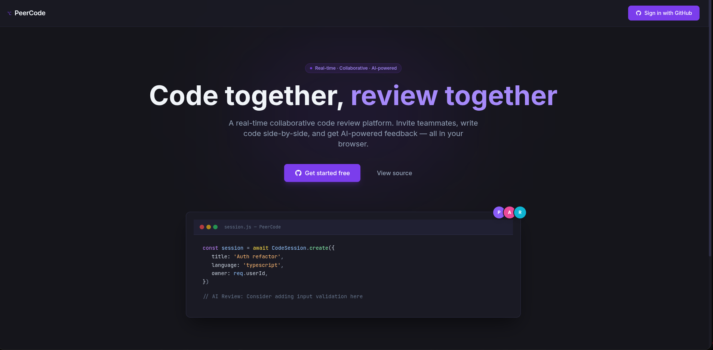
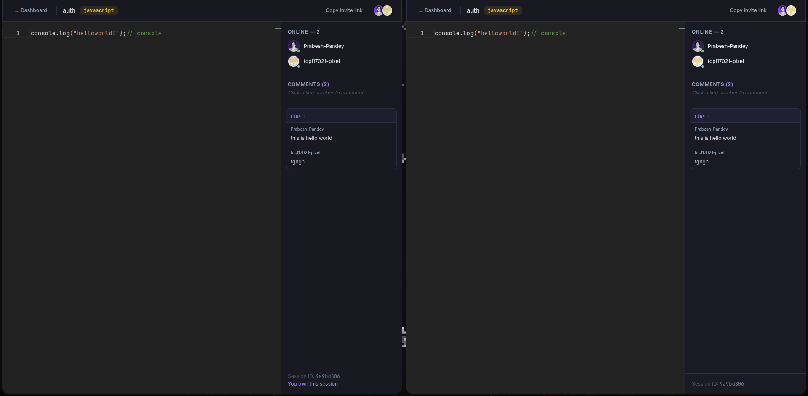

<h1 align="center">
  <br>
  PeerCode
  <br>
</h1>

<h4 align="center">A real-time collaborative code review platform built with MongoDB · Express · React · Socket.io</h4>

<p align="center">
  
  
  
  
  
  
</p>

<p align="center">
  <a href="#features">Features</a> •
  <a href="#screenshots">Screenshots</a> •
  <a href="#tech-stack">Tech Stack</a> •
  <a href="#project-structure">Project Structure</a> •
  <a href="#getting-started">Getting Started</a> •
  <a href="#environment-variables">Environment Variables</a> •
  <a href="#api-reference">API Reference</a> •
  <a href="#deployment">Deployment</a>
</p>

---

## Features

| Feature              | Description                                                                             |
| -------------------- | --------------------------------------------------------------------------------------- |
| **Real-time Sync**   | See every keystroke as it happens — zero lag collaborative editing powered by Socket.io |
| **AI Code Review**   | Get instant feedback from Claude AI streamed inline as comments on your code            |
| **GitHub OAuth**     | One-click sign-in with your GitHub account — no passwords, no friction                  |
| **Monaco Editor**    | The same editor that powers VS Code with syntax highlighting for 8+ languages           |
| **Live Presence**    | See who else is in the session with real-time avatar indicators                         |
| **Inline Comments**  | Click any line number to leave threaded comments synchronized across all participants   |
| **Auto-save**        | Code debounce-saves to MongoDB automatically every 1 second of inactivity               |
| **JWT Auth**         | Secure httpOnly cookie-based JWT authentication with CSRF protection                    |
| **Docker Ready**     | Full Docker Compose setup for local development                                         |
| **CI/CD**            | GitHub Actions pipeline for automated build and deployment                              |

---

## Screenshots

### Landing Page



### Features Section



---

## Tech Stack

### Backend

| Technology                     | Purpose                                |
| ------------------------------ | -------------------------------------- |
| **Node.js 20** (ES Modules)    | Runtime                                |
| **Express.js 5**               | HTTP server & REST API                 |
| **MongoDB Atlas + Mongoose 9** | Database & ODM                         |
| **Socket.io 4**                | Real-time WebSocket communication      |
| **GitHub OAuth 2.0** (manual)  | Authentication (no Passport.js)        |
| **JSON Web Token**             | Session management via httpOnly cookie |
| **Zod**                        | Request validation                     |
| **express-rate-limit**         | API rate limiting                      |
| **node-fetch**                 | GitHub API calls                       |

### Frontend

| Technology                                 | Purpose                         |
| ------------------------------------------ | ------------------------------- |
| **React 19 + Vite**                        | UI framework & build tool       |
| **React Router v7**                        | Client-side routing             |
| **Tailwind CSS 3**                         | Utility-first styling           |
| **Monaco Editor** (`@monaco-editor/react`) | Code editor (same as VS Code)   |
| **Socket.io-client**                       | Real-time connection to backend |

### DevOps

| Technology                  | Purpose                         |
| --------------------------- | ------------------------------- |
| **Docker + Docker Compose** | Containerized local development |
| **GitHub Actions**          | CI/CD pipeline                  |
| **Railway**                 | Backend deployment              |
| **Vercel**                  | Frontend deployment             |

---

## Project Structure

```
PeerCode/
├── backend/
│   ├── config/
│   │   ├── db.js              # Mongoose connection
│   │   └── constants.js       # Non-secret fixed values (languages, cookie opts)
│   ├── middleware/
│   │   └── requireAuth.js     # JWT verification middleware
│   ├── models/
│   │   ├── User.js            # githubId, username, name, email, avatarUrl
│   │   ├── CodeSession.js     # title, language, code, owner, participants
│   │   └── Comment.js         # sessionId, lineNumber, text, author, isAiGenerated
│   ├── routes/
│   │   ├── auth.js            # GitHub OAuth + JWT routes
│   │   ├── sessions.js        # CodeSession CRUD
│   │   └── comments.js        # Inline comment routes
│   ├── socket/
│   │   └── index.js           # Socket.io event handlers
│   ├── Dockerfile
│   └── server.js              # App entry point
│
├── frontend/
│   ├── src/
│   │   ├── components/
│   │   │   ├── CodeEditor.jsx      # Monaco Editor wrapper
│   │   │   ├── ErrorBoundary.jsx   # React error boundary
│   │   │   ├── NewSessionModal.jsx # Create session dialog
│   │   │   └── ProtectedRoute.jsx  # Auth guard HOC
│   │   ├── context/
│   │   │   └── AuthContext.jsx     # Global auth state
│   │   ├── hooks/
│   │   │   └── useSocket.js        # Socket.io custom hook
│   │   ├── pages/
│   │   │   ├── Landing.jsx         # Landing / marketing page
│   │   │   ├── Dashboard.jsx       # Session management
│   │   │   ├── Session.jsx         # Live coding session
│   │   │   └── NotFound.jsx        # 404 page
│   │   ├── api.js                  # Axios/fetch wrapper
│   │   ├── constants.js            # Shared constants
│   │   └── App.jsx                 # Root component & routes
│   ├── index.html
│   └── vite.config.js
│
├── assets/                    # Screenshots and static assets
├── docker-compose.yml
└── ROADMAP.md
```

---

## Getting Started

### Prerequisites

- **Node.js** v20+
- **npm** v10+
- **MongoDB Atlas** account (free tier works)
- **GitHub OAuth App** (for authentication)
- **Docker** (optional, for Docker Compose setup)

### 1. Clone the repository

```bash
git clone https://github.com/your-username/PeerCode.git
cd PeerCode
```

### 2. Set up environment variables

**Backend** — create `backend/.env`:

```env
PORT=8000
MONGODB_URI=mongodb+srv://<user>:<password>@cluster.mongodb.net/peercode
GITHUB_CLIENT_ID=your_github_client_id
GITHUB_CLIENT_SECRET=your_github_client_secret
JWT_SECRET=your_super_secret_jwt_key_min_32_chars
NODE_ENV=development
CLIENT_URL=http://localhost:5173
SERVER_URL=http://localhost:8000
```

**Frontend** — create `frontend/.env`:

```env
VITE_API_URL=http://localhost:8000
```

### 3a. Run with Docker Compose (recommended)

```bash
docker-compose up --build
```

This starts:

- **Backend** on `http://localhost:8000`
- **Frontend** on `http://localhost:5173`

### 3b. Run manually (without Docker)

**Backend:**

```bash
cd backend
npm install
npm run dev
```

**Frontend** (in a new terminal):

```bash
cd frontend
npm install
npm run dev
```

Then open **http://localhost:5173** in your browser.

---

## Environment Variables

### Backend (`backend/.env`)

| Variable               | Required | Description                                                          |
| ---------------------- | -------- | -------------------------------------------------------------------- |
| `PORT`                 | No       | Server port (default: `8000`)                                        |
| `MONGODB_URI`          | ✅       | MongoDB Atlas connection string                                      |
| `GITHUB_CLIENT_ID`     | ✅       | GitHub OAuth App client ID                                           |
| `GITHUB_CLIENT_SECRET` | ✅       | GitHub OAuth App client secret                                       |
| `JWT_SECRET`           | ✅       | Secret key for signing JWTs (32+ chars)                              |
| `NODE_ENV`             | No       | `development` or `production`                                        |
| `CLIENT_URL`           | No       | Frontend URL for CORS & redirects (default: `http://localhost:5173`) |
| `SERVER_URL`           | No       | Backend URL for OAuth callback (default: `http://localhost:8000`)    |

### Frontend (`frontend/.env`)

| Variable       | Required | Description          |
| -------------- | -------- | -------------------- |
| `VITE_API_URL` | ✅       | Backend API base URL |

### Creating a GitHub OAuth App

1. Go to **GitHub → Settings → Developer Settings → OAuth Apps → New OAuth App**
2. Set **Homepage URL**: `http://localhost:5173`
3. Set **Authorization callback URL**: `http://localhost:8000/auth/callback`
4. Copy the **Client ID** and **Client Secret** into `backend/.env`

---

## API Reference

### Auth

| Method | Endpoint         | Auth | Description                     |
| ------ | ---------------- | ---- | ------------------------------- |
| `GET`  | `/auth/github`   | —    | Redirect to GitHub OAuth        |
| `GET`  | `/auth/callback` | —    | OAuth callback, sets JWT cookie |
| `GET`  | `/auth/me`       | ✅   | Get logged-in user profile      |
| `POST` | `/auth/logout`   | ✅   | Clear JWT cookie                |

### Sessions

| Method   | Endpoint             | Auth | Description                        |
| -------- | -------------------- | ---- | ---------------------------------- |
| `GET`    | `/sessions`          | ✅   | List all sessions for current user |
| `POST`   | `/sessions`          | ✅   | Create a new code session          |
| `GET`    | `/sessions/:id`      | ✅   | Get session by ID                  |
| `PATCH`  | `/sessions/:id/code` | ✅   | Update session code content        |
| `DELETE` | `/sessions/:id`      | ✅   | Delete a session (owner only)      |

### Comments

| Method | Endpoint               | Auth | Description                    |
| ------ | ---------------------- | ---- | ------------------------------ |
| `GET`  | `/comments/:sessionId` | ✅   | Get all comments for a session |
| `POST` | `/comments/:sessionId` | ✅   | Post a new inline comment      |

### Health

| Method | Endpoint  | Auth | Description                              |
| ------ | --------- | ---- | ---------------------------------------- |
| `GET`  | `/health` | —    | Server health check → `{ status: "ok" }` |

### Socket.io Events

| Event             | Direction              | Payload                     | Description               |
| ----------------- | ---------------------- | --------------------------- | ------------------------- |
| `code:change`     | client → server → room | `{ sessionId, code }`       | Broadcast live code edits |
| `comment:new`     | client → server → room | `{ sessionId, comment }`    | Broadcast new comment     |
| `presence:update` | server → room          | `[{ username, avatarUrl }]` | Live participant list     |

---

## Key Design Decisions

- **No Redis** — Presence/participants tracked in MongoDB via `$addToSet` / `$pull` on `CodeSession.participants`
- **No Passport.js** — GitHub OAuth implemented from scratch for full control and learning
- **No Prisma** — Pure Mongoose; no migrations ever needed
- **ES Modules throughout** — `"type": "module"` in both `backend/package.json` and `frontend/package.json`
- **isRemoteUpdate ref flag** — Prevents infinite emit loops during live code sync (critical for Socket.io + Monaco)

---

## Deployment

### Backend — Railway

1. Connect your GitHub repo to [Railway](https://railway.app)
2. Set root directory to `backend/`
3. Add all environment variables from `backend/.env` (production values)
4. Railway auto-detects Node.js and runs `npm start`

### Frontend — Vercel

1. Import your GitHub repo on [Vercel](https://vercel.com)
2. Set root directory to `frontend/`
3. Set build command: `npm run build`
4. Set output directory: `dist`
5. Add `VITE_API_URL` pointing to your Railway backend URL

### Docker (Production Build)

```bash
# Build and run the backend container
cd backend
docker build -t peercode-backend .
docker run -p 8000:8000 --env-file .env peercode-backend
```

---

<p align="center">
  <sub>Made by Prabesh Pandey</sub>
</p>
